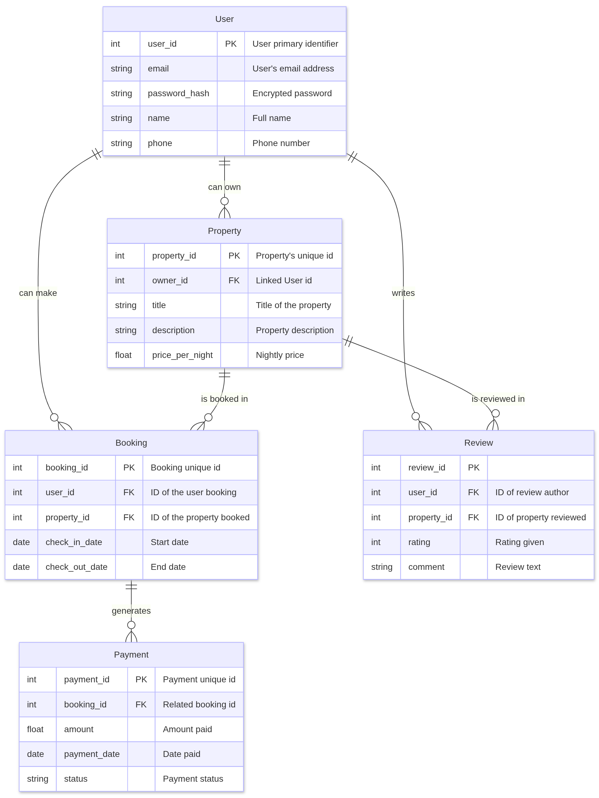

  <h1>🏠 Airbnb Clone Project</h1>
  
A scalable backend for a booking platform inspired by Airbnb

  
  

---

## 📋 Project Overview
The **Airbnb Clone Project** is a full-stack application designed to replicate
core Airbnb functionalities, including user management, property listings, bookings, and reviews.
This project focuses on building a robust, secure, and scalable backend using modern technologies to deliver a seamless user and host experience.

### 🎯 Project Goals
- **User Management**: Secure registration, authentication, and profile management.
- **Property Management**: Create, Update, and Retrieve property listings.
- **Booking System**: Facilitate property reservations with check-in/check-out management.
- **Payment Processing**: Handle secure payment transactions.
- **Review System**: Enable users to post and manage property reviews.
- **Data Optimization**: Optimize data retrieval and storage with indexing and caching.

---

##  🛠️ Technology Stack
| Technology                | Purpose                               |
|---------------------------|---------------------------------------|
| **Django**                | Python web framework for building secure and scalable RESTful APIs. |
| **Django REST Framework** | Simplifies API development with tools for CRUD operations. |
| **PostgreSQL**            | Relational database for storing user, property, and booking data. |
| **GraphQL**               | Flexible query language for efficient, client-driven data retrieval. |
| **Celery**                | Handles asynchronous tasks like notifications and payment processing. |
| **Redis**                 | Supports caching and session management to enhance performance. |
| **Docker**                | Ensures consistent development and deployment environments. |
| **CI/CD Pipelines**       | Automates testing and deployment using tools like GitHub Actions.|

---

## 👥 Team Roles
| Role                  | Responsibilities                                |
|-----------------------|-------------------------------------------------|
| **Backend Developer** | Implements API endpoints, database schemas, and business logic for core features. |
| **Database Admin**    | Designs and optimizes PostgreSQL schemas, implements indexing for performance. |
| **DevOps Engineer**   | Manages deployment, scaling, and monitoring using Docker and CI/CD pipelines. |
| **QA Engineer**       | Tests backend functionalities to ensure reliability, security, and quality. |

---

## 🗄️ Database Design
The database is structured using **PostgreSQL** to manage key entities and their relationships.

| Entity      | Key Fields                       | Relationships           |
|-------------|----------------------------------|-------------------------|
| **Users**   | `user_id` (PK), `email`, `password_hash`, `name`, `phone` | Owns multiple properties; creates bookings/review (1:N). |
| **Properties** | `property_id` (PK), `owner_id` (FK), `title`, `description`, `price_per_night` | Belongs to one user; has multiple bookings/reviews (1:N). |
| **Bookings** | `booking_id` (PK), `user_id` (FK), `property_id` (FK), `check_in_date`, `check_out_date` | Belongs to one user and one property (N:1). |
| **Reviews** | `review_id` (PK),`user_id` (FK), `property_id` (FK), `rating`, `comment` | Belongs to one user and one property (N:1). |
| **Payments** | `payment_id` (PK), `booking_id` (FK), `amount`, `payment_date`, `status` | Belongs to one booking (N:1). |

*Database Schema for Airbnb Clone: Visual representation of entities and relationships, including User, Properties, Bookings, Reviews, and Payments.*

---

## 🚀 Feature Breakdown
- **User Management**

Securely handles user registration, authentication, and profile updates. This feature ensures a personalized and safe platform experience.

- **Property Management**

Enables hosts to create, update and delete listings, forming the core of the platform. It allows users to browse and select accommodations easily.

- **Booking System**

Streamlines property reservations with check-in/check-out management. It connects users and hosts for efficient booking workflows.

- **Payment Processing**

Integrates secure payment gateways for booking transactions. Ensures trust and reliability in financial operations.

- **Review System**

Allows users to post ratings and comments for properties. Enhances transparency and helps users make informed decisions.

- **Data Optimization**

Leverages indexing and Redis caching to improve data retrieval speed. Ensures a fast, responsive user experience.

---

## 🔒 API Security
Securing the backend APIs is critical for protecting user data and ensuring platform integrity. Key measures include:
- **Authentication**
Uses **JWT (JSON Web Tokens)** to verify user identity, preventing unauthorized access to protected endpoints like user profiles.

- **Authorization**
Implements **role-based access control** (e.g., hosts vs. guests) to restrict actions like property updates.
Ensures users only perform permitted actions.

- **Rate Limiting**
Limits API request frequency to prevent abuse and DDoS attacks. Maintains platform stability and resource availability.

- **Data Encryption**
Employs **HTTPS** and encrypted database storage for sensitive data like payment details. Builds user trust and complies with data protection standards.

🔍 Additional Security Details

- **Input Validation**: Prevents SQL injection and XSS attacks by sanitizing user inputs.
- **Secure Password Hashing**: Uses bcrypt to securely hash passwords, protecting user credentials.
- **Regular Security Audits**: Conducts periodic audits to identify and mitigate vulnerabilities.

---

## ⚙️  CI/CD Pipeline
**CI/CD pipelines** automate testing, building, and deploying code changes, ensuring reliable and efficient development cycles.
They reduce errors, maintain code quality, and enable seamless deployment of the backend.

- **Tools Used**:
  - **GitHub Actions**: Automates testing and deployment workflows.
  - **Docker**: Ensures consistent environments across development, testing, and production.

- **Why It Matters**:
  - Catches bugs early through automated tests.
  - Speeds up deployment with minimal intervention.
  - Supports scalability by standardizing environments.

---

## 📅 Project Timeline
- **Start** : October 13, 2025, 12:00 AM
- **End** : October 20, 2025, 12:00 AM
- **Submission** : Generate review link and request peer/manual QA reviews before the deadline.

---

## 📚 Resources
- [System Design Architecture for Hotel Booking Apps](https://medium.com/nerd-for-tech/system-design-architecture-for-hotel-booking-apps-like-airbnb-oyo-6efb4f4dddd7)
- [Software Development Team Structure](https://itrexgroup.com/blog/software-development-team-structure-roles-responsibilities/) *(ITRexGroup blog reference)*
- [Django Documentation](https://docs.djangoproject.com/)
- [GraphQL Documentation](https://graphql.org/)

---

  
✨ Built with❤️ for learning and innovation ✨

  
Created by <strong>Phinehas Macharia</strong>

